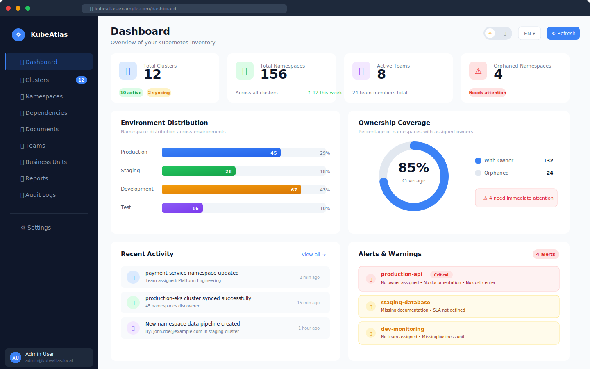
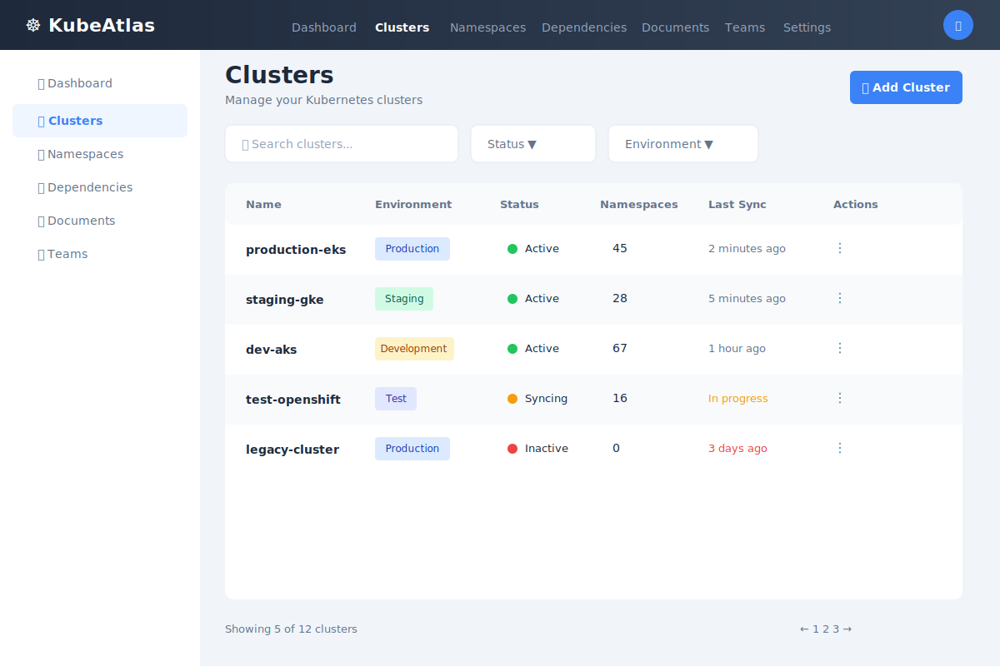
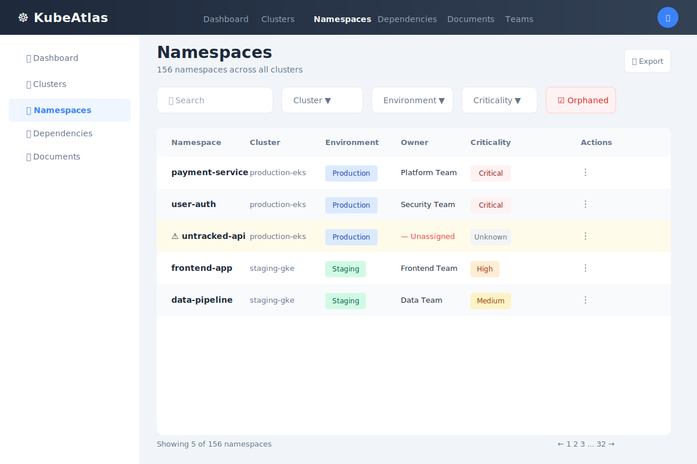
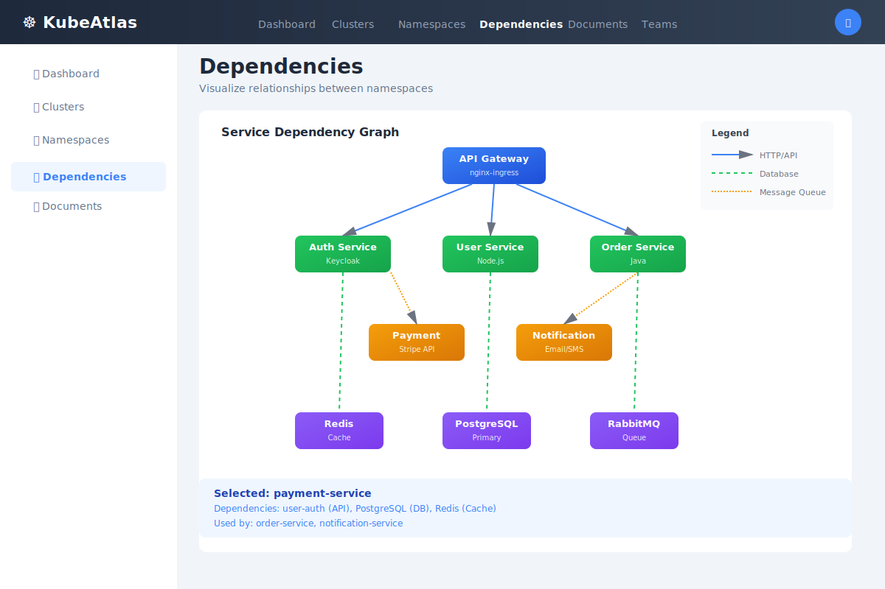
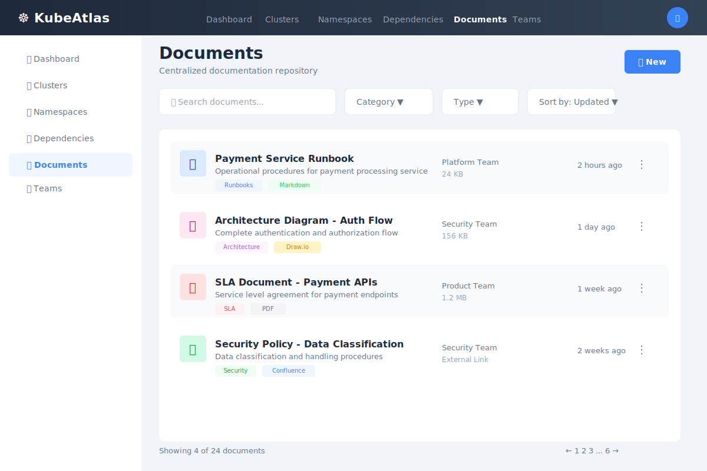
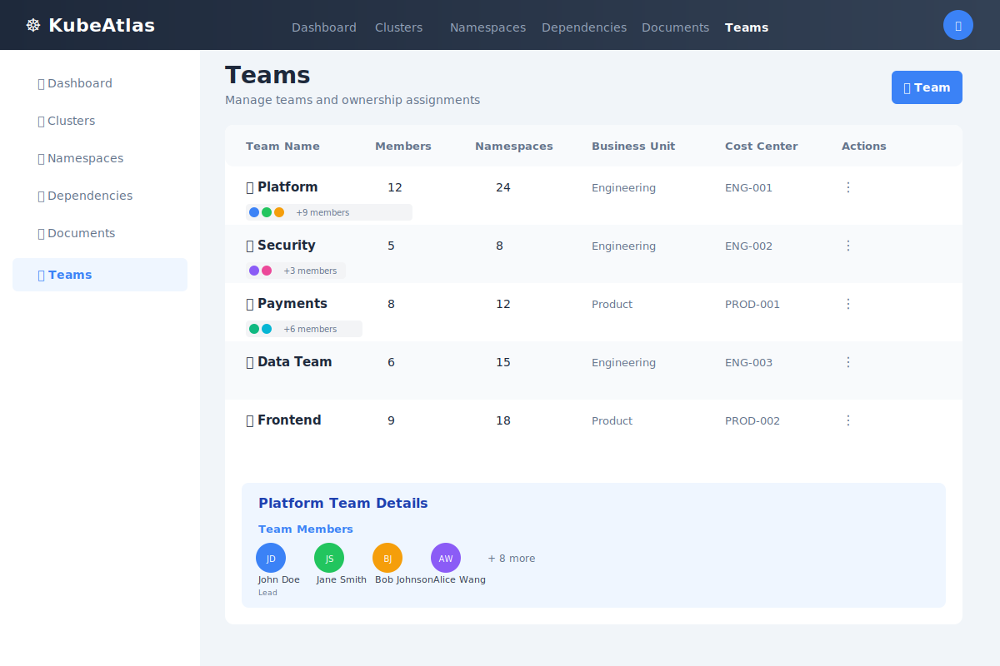
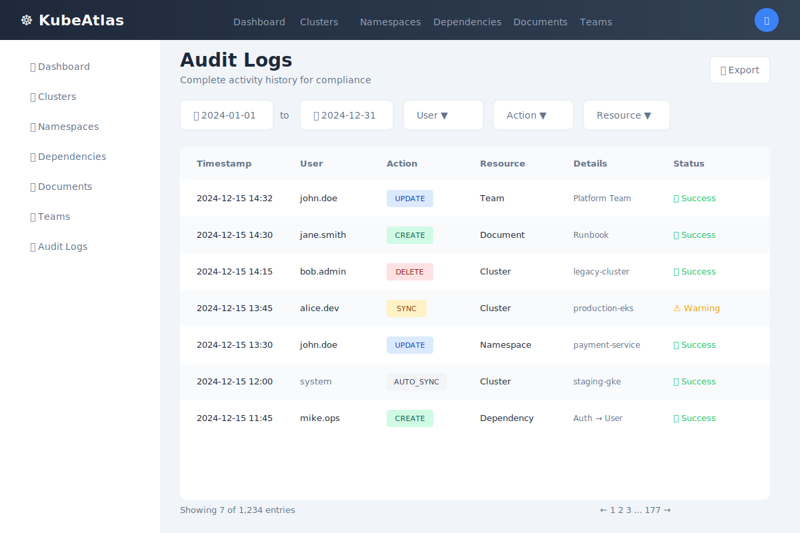
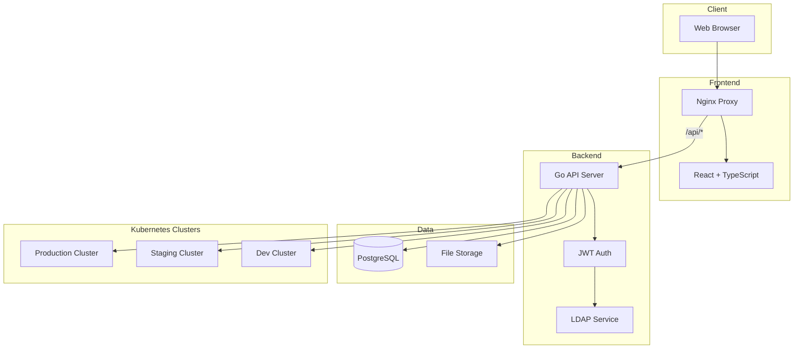

<div align="center">


# KubeAtlas

**Kubernetes Inventory & Governance Platform**

[](https://github.com/ozcanfpolat/kubeatlas/actions/workflows/ci.yml)
[](https://github.com/ozcanfpolat/kubeatlas/releases)
[](LICENSE)
[](https://go.dev/)
[](https://react.dev/)
[](https://kubernetes.io/)

[Features](#-features) • [Screenshots](#-screenshots) • [Quick Start](#-quick-start) • [Installation](#-installation) • [Documentation](#-documentation)

</div>

---

## 📖 Overview

**KubeAtlas** is a comprehensive governance platform designed to bring clarity and ownership visibility to Kubernetes/OpenShift estates. Unlike observability tools that focus on metrics and logs, KubeAtlas centers on **operational ownership**, **accountability**, and **governance**.

### The Problem

Managing multiple Kubernetes clusters across different teams and environments often leads to:

| Challenge | Impact |
|-----------|--------|
| 🔍 **Unknown ownership** | "Who owns this namespace?" |
| 📋 **Missing documentation** | "Where are the runbooks?" |
| 🔗 **Hidden dependencies** | "What breaks if this changes?" |
| 📊 **No governance visibility** | "Are we compliant?" |

### The Solution

KubeAtlas provides a **central source of truth** for all your Kubernetes resources with ownership tracking, dependency mapping, document management, and complete audit trails.

---

## ✨ Features

### Core Capabilities

| Feature | Description |
|---------|-------------|
| 📊 **Dashboard** | Real-time overview with metrics, charts, and alerts |
| 🔐 **Ownership Management** | Track owners, teams, and business units |
| 📦 **Cluster Inventory** | Multi-cluster support with auto-discovery |
| 🔗 **Dependency Mapping** | Interactive D3.js visualization of dependencies |
| 📄 **Document Management** | Centralize runbooks, SLAs, architecture docs |
| 📝 **Audit Trail** | Complete history of all changes with export |
| 🌍 **Multi-language** | English and Turkish UI support |
| 🎨 **Theme Support** | Light, dark, and system themes |

### Enterprise Features

| Feature | Description |
|---------|-------------|
| 🔒 **LDAP/Active Directory** | Enterprise SSO with group-based roles |
| 👥 **Role-Based Access** | Admin, Editor, Viewer roles |
| 📊 **Reports & Export** | Excel export for compliance reporting |
| 🔐 **Encryption** | AES-256-GCM for sensitive data |

---

## 📸 Screenshots

### Dashboard

The main dashboard provides a comprehensive overview of your Kubernetes inventory with real-time metrics, environment distribution charts, ownership coverage, recent activities, and alerts.

<p align="center">
  
</p>

**Key Features:**
- **Metric Cards**: Total clusters, namespaces, teams, and orphaned resources at a glance
- **Environment Distribution**: Visual breakdown of namespaces across Production, Staging, Development, and Test
- **Ownership Coverage**: Donut chart showing percentage of namespaces with assigned owners
- **Recent Activity**: Live feed of namespace updates, cluster syncs, and user actions
- **Alerts Panel**: Critical and warning alerts for namespaces needing attention

### More Screenshots

<details>
<summary>📦 Cluster Management</summary>
<br/>


- View all connected Kubernetes/OpenShift clusters
- Real-time sync status and namespace counts
- One-click cluster synchronization
- Secure credential management

</details>

<details>
<summary>📋 Namespace Details</summary>
<br/>


- Complete namespace inventory across all clusters
- Owner, team, and business unit assignment
- Environment tagging (Production, Staging, Development, Test)
- Quick filters and search functionality

</details>

<details>
<summary>🔗 Dependency Visualization</summary>
<br/>


- Interactive D3.js force-directed graph
- Internal namespace-to-namespace dependencies
- External service dependencies (APIs, databases, CDNs)
- Drag-and-drop node positioning
- Protocol and port information

</details>

<details>
<summary>📄 Document Management</summary>
<br/>


- Centralized runbooks, SLAs, and architecture docs
- Link documents to specific namespaces
- Upload, view, and download functionality
- Document categorization

</details>

<details>
<summary>👥 Team Management</summary>
<br/>


- Create and manage teams
- Assign team members
- Link teams to namespaces
- View team ownership statistics

</details>

<details>
<summary>📝 Audit Logs</summary>
<br/>


- Complete history of all changes
- Filter by user, action type, and date
- Export to Excel for compliance reporting
- Detailed before/after change tracking

</details>

---

## 🏗️ Architecture



### Tech Stack

| Layer | Technology | Purpose |
|-------|------------|---------|
| **Frontend** | React 18, TypeScript, Tailwind CSS, shadcn/ui | Modern UI with type safety |
| **Backend** | Go 1.21, Gin Framework | High-performance REST API |
| **Database** | PostgreSQL 15+ | Persistent data storage |
| **Auth** | JWT + LDAP/Active Directory | Secure authentication |
| **Deployment** | Docker, Kubernetes, Helm, OpenShift | Container orchestration |

---

## 🚀 Quick Start

### Prerequisites

- Docker & Docker Compose v2.0+
- Git

### One-Command Start

```bash
# Clone repository
git clone https://github.com/ozcanfpolat/kubeatlas.git
cd kubeatlas

# Create environment file with secure secrets
cp .env.example .env
sed -i "s/CHANGE_ME_secure_password_here/$(openssl rand -base64 16)/g" .env
sed -i "s/CHANGE_ME_generate_with_openssl_rand_base64_32/$(openssl rand -base64 32)/g" .env
sed -i "s/CHANGE_ME_generate_with_openssl_rand_hex_32/$(openssl rand -hex 32)/g" .env

# Start with database
docker-compose --profile with-db up -d

# Wait for services (about 30 seconds)
echo "Waiting for services to start..."
sleep 30

# Access the application
echo "✅ KubeAtlas is ready!"
echo "🌐 Open: http://localhost"
echo "👤 Login: admin@kubeatlas.local / admin123"
```

---

## 📦 Installation

### Option 1: Kubernetes (Helm) — Recommended

```bash
# Add Helm repository (if published)
helm repo add kubeatlas https://ozcanfpolat.github.io/kubeatlas
helm repo update

# Or install from local chart
git clone https://github.com/ozcanfpolat/kubeatlas.git
cd kubeatlas

# Create namespace
kubectl create namespace kubeatlas

# Create secrets
kubectl create secret generic kubeatlas-secrets \
  --namespace kubeatlas \
  --from-literal=DB_PASSWORD="$(openssl rand -base64 16)" \
  --from-literal=JWT_SECRET="$(openssl rand -base64 32)" \
  --from-literal=ENCRYPTION_KEY="$(openssl rand -hex 32)"

# Install with PostgreSQL
helm install kubeatlas ./helm/kubeatlas \
  --namespace kubeatlas \
  --set postgresql.enabled=true \
  --set postgresql.auth.password="your-db-password" \
  --set ingress.enabled=true \
  --set ingress.hosts[0].host=kubeatlas.example.com

# Wait for pods
kubectl wait --for=condition=ready pod -l app.kubernetes.io/name=kubeatlas -n kubeatlas --timeout=300s

# Get the URL
kubectl get ingress -n kubeatlas
```

<details>
<summary>📋 Example values.yaml</summary>

```yaml
# values.yaml
replicaCount: 2

image:
  api:
    repository: ghcr.io/ozcanfpolat/kubeatlas-api
    tag: latest
  ui:
    repository: ghcr.io/ozcanfpolat/kubeatlas-ui
    tag: latest

postgresql:
  enabled: true
  auth:
    database: kubeatlas
    username: kubeatlas
    password: "secure-password"

ingress:
  enabled: true
  className: nginx
  annotations:
    nginx.ingress.kubernetes.io/proxy-body-size: "50m"
  hosts:
    - host: kubeatlas.example.com
      paths:
        - path: /
          pathType: Prefix
  tls:
    - secretName: kubeatlas-tls
      hosts:
        - kubeatlas.example.com
```

</details>

### Option 2: Docker Compose

```bash
# Clone repository
git clone https://github.com/ozcanfpolat/kubeatlas.git
cd kubeatlas

# Configure environment
cp .env.example .env
vim .env  # Edit with your settings

# Start services with database
docker-compose --profile with-db up -d

# View logs
docker-compose logs -f

# Stop services
docker-compose down
```

### Option 3: OpenShift

```bash
# Create project
oc new-project kubeatlas

# Create GitHub registry secret
oc create secret docker-registry ghcr-secret \
  --docker-server=ghcr.io \
  --docker-username=YOUR_GITHUB_USERNAME \
  --docker-password=YOUR_GITHUB_TOKEN

# Create application secrets
oc create secret generic kubeatlas-secrets \
  --from-literal=DB_PASSWORD="$(openssl rand -base64 16)" \
  --from-literal=JWT_SECRET="$(openssl rand -base64 32)" \
  --from-literal=ENCRYPTION_KEY="$(openssl rand -hex 32)"

# Install PostgreSQL
helm install kubeatlas-db bitnami/postgresql \
  --set auth.username=kubeatlas \
  --set auth.password=YOUR_DB_PASSWORD \
  --set auth.database=kubeatlas \
  --set primary.podSecurityContext.enabled=false \
  --set primary.containerSecurityContext.enabled=false

# Deploy KubeAtlas
oc apply -f deploy/openshift/manual-install.yaml

# Get route URL
oc get route kubeatlas -o jsonpath='{.spec.host}'
```

See [deploy/openshift/MANUAL_INSTALL.md](deploy/openshift/MANUAL_INSTALL.md) for detailed instructions.

---

## 🔐 Authentication

### Default Credentials

| Field | Value |
|-------|-------|
| Email | `admin@kubeatlas.local` |
| Password | `admin123` |

> ⚠️ **Change the default password immediately after first login!**

### LDAP / Active Directory Integration

KubeAtlas supports enterprise LDAP authentication with automatic user provisioning:

1. Navigate to **Settings → LDAP**
2. Configure your LDAP server:

| Setting | Example |
|---------|---------|
| Server URL | `ldaps://ldap.example.com:636` |
| Bind DN | `cn=service,ou=services,dc=example,dc=com` |
| Bind Password | `••••••••` |
| Search Base | `ou=users,dc=example,dc=com` |
| Search Filter | `(uid={username})` |

3. Configure group-to-role mapping:

| LDAP Group | KubeAtlas Role | Permissions |
|------------|----------------|-------------|
| `kubeatlas-admins` | Admin | Full access |
| `kubeatlas-editors` | Editor | Create/Edit |
| `kubeatlas-viewers` | Viewer | Read only |

4. Click **Test Connection** to verify, then **Save**

**How it works:**
- User logs in with LDAP credentials
- KubeAtlas authenticates against LDAP server
- User is auto-created in local database
- Role is determined by LDAP group membership
- Role updates on each login if groups change

### Role Permissions Matrix

| Permission | Viewer | Editor | Admin |
|------------|:------:|:------:|:-----:|
| View all resources | ✅ | ✅ | ✅ |
| Create resources | ❌ | ✅ | ✅ |
| Edit resources | ❌ | ✅ | ✅ |
| Delete resources | ❌ | ❌ | ✅ |
| Manage users | ❌ | ❌ | ✅ |
| Configure LDAP | ❌ | ❌ | ✅ |
| View audit logs | ✅ | ✅ | ✅ |
| Export reports | ✅ | ✅ | ✅ |

---

## 🔗 Adding Kubernetes Clusters

### Step 1: Create Service Account

Run this in your **target cluster**:

```bash
kubectl apply -f - <<EOF
apiVersion: v1
kind: Namespace
metadata:
  name: kubeatlas-agent
---
apiVersion: v1
kind: ServiceAccount
metadata:
  name: kubeatlas-agent
  namespace: kubeatlas-agent
---
apiVersion: rbac.authorization.k8s.io/v1
kind: ClusterRole
metadata:
  name: kubeatlas-reader
rules:
- apiGroups: [""]
  resources: ["namespaces", "pods", "services", "configmaps"]
  verbs: ["get", "list", "watch"]
- apiGroups: ["apps"]
  resources: ["deployments", "statefulsets", "daemonsets"]
  verbs: ["get", "list", "watch"]
---
apiVersion: rbac.authorization.k8s.io/v1
kind: ClusterRoleBinding
metadata:
  name: kubeatlas-reader
roleRef:
  apiGroup: rbac.authorization.k8s.io
  kind: ClusterRole
  name: kubeatlas-reader
subjects:
- kind: ServiceAccount
  name: kubeatlas-agent
  namespace: kubeatlas-agent
---
apiVersion: v1
kind: Secret
metadata:
  name: kubeatlas-agent-token
  namespace: kubeatlas-agent
  annotations:
    kubernetes.io/service-account.name: kubeatlas-agent
type: kubernetes.io/service-account-token
EOF
```

### Step 2: Get Credentials

```bash
# Get token
TOKEN=$(kubectl get secret kubeatlas-agent-token -n kubeatlas-agent \
  -o jsonpath='{.data.token}' | base64 -d)

# Get API server URL
API_URL=$(kubectl config view --minify -o jsonpath='{.clusters[0].cluster.server}')

# Get CA certificate (for self-signed clusters)
kubectl get secret kubeatlas-agent-token -n kubeatlas-agent \
  -o jsonpath='{.data.ca\.crt}' | base64 -d > cluster-ca.crt

echo "API URL: $API_URL"
echo "Token: $TOKEN"
```

### Step 3: Add in KubeAtlas UI

1. Go to **Clusters → Add Cluster**
2. Enter cluster details:
   - **Name:** `production-cluster`
   - **API Server URL:** (from Step 2)
   - **Token:** (from Step 2)
3. Upload CA certificate or enable "Skip TLS Verification" (dev only!)
4. Click **Create** then **Sync**

---

## 🔧 Configuration

### Environment Variables

| Variable | Description | Default | Required |
|----------|-------------|---------|:--------:|
| `DB_HOST` | PostgreSQL host | `localhost` | ✅ |
| `DB_PORT` | PostgreSQL port | `5432` | |
| `DB_USER` | Database user | `kubeatlas` | |
| `DB_PASSWORD` | Database password | - | ✅ |
| `DB_NAME` | Database name | `kubeatlas` | |
| `DB_SSLMODE` | SSL mode | `disable` | |
| `JWT_SECRET` | JWT signing secret (32+ chars) | - | ✅ |
| `JWT_EXPIRATION_HOURS` | Token expiration | `24` | |
| `ENCRYPTION_KEY` | AES-256 key (64 hex chars) | - | ✅ |
| `STORAGE_LOCAL_PATH` | Upload storage path | `/app/data/uploads` | |

### Generating Secrets

```bash
# JWT Secret (base64, 32+ characters)
openssl rand -base64 32

# Encryption Key (hex, 64 characters for AES-256)
openssl rand -hex 32

# Database Password
openssl rand -base64 16
```

---

## 📁 Project Structure

```
kubeatlas/
├── backend/                    # Go API server
│   ├── cmd/server/            # Application entrypoint
│   └── internal/
│       ├── api/               # HTTP handlers & middleware
│       │   ├── handlers/      # Request handlers
│       │   └── middleware/    # Auth, CORS, logging
│       ├── config/            # Configuration
│       ├── database/          # Repositories
│       ├── models/            # Data models
│       ├── services/          # Business logic
│       │   ├── auth_service.go
│       │   ├── ldap_service.go
│       │   └── ...
│       └── k8s/               # Kubernetes client
├── frontend/                   # React TypeScript UI
│   ├── src/
│   │   ├── api/              # API client
│   │   ├── components/       # Reusable components
│   │   ├── pages/            # Page components
│   │   ├── i18n/             # Translations (EN/TR)
│   │   └── store/            # State management
│   ├── nginx.conf.template   # Nginx configuration
│   └── Dockerfile
├── database/
│   ├── schema.sql            # Database schema
│   └── seed.sql              # Initial data
├── deploy/
│   └── openshift/            # OpenShift manifests
├── helm/kubeatlas/           # Helm chart
├── docker-compose.yml        # Docker Compose
└── docs/                     # Documentation
```

---

## 🔒 Security

### Data Encryption

- All sensitive data encrypted with **AES-256-GCM**
- Includes: cluster tokens, kubeconfig, CA certificates
- Encryption key must be 32+ characters

### Authentication Security

- JWT tokens with configurable expiration
- Secure password hashing with bcrypt
- Rate limiting on login endpoints (5 attempts/15 min)
- LDAP bind password never logged or returned

### Best Practices

1. **Never commit secrets** to version control
2. **Use TLS** for all connections in production
3. **Rotate secrets** regularly
4. **Minimal permissions** for Kubernetes service accounts
5. **Enable LDAP** for enterprise deployments
6. **Regular backups** of PostgreSQL database

---

## 🐛 Troubleshooting

### Common Issues

| Issue | Cause | Solution |
|-------|-------|----------|
| `401 Unauthorized` | Invalid/expired token | Regenerate service account token |
| `x509: certificate signed by unknown authority` | Self-signed cert | Upload CA cert or enable skip_tls_verify |
| `connection refused` | Network/firewall | Check network policies |
| Login fails | Wrong credentials | Check email/password, reset if needed |
| LDAP test fails | Wrong config | Verify bind DN, password, search base |
| Users not appearing | Cache issue | Click "Refresh" button |

### Checking Logs

```bash
# Docker Compose
docker-compose logs -f kubeatlas-api
docker-compose logs -f kubeatlas-ui

# Kubernetes
kubectl logs -f deployment/kubeatlas-api -n kubeatlas
kubectl logs -f deployment/kubeatlas-ui -n kubeatlas

# OpenShift
oc logs -f deployment/kubeatlas-api
oc logs -f deployment/kubeatlas-ui
```

### Health Checks

```bash
# API health
curl http://localhost:8080/health
curl http://localhost:8080/ready

# UI health
curl http://localhost/health
```

---

## 📚 Documentation

| Document | Description |
|----------|-------------|
| [Installation Guide](docs/INSTALLATION.md) | Detailed installation instructions |
| [Deployment Guide](docs/DEPLOYMENT.md) | Production deployment guide |
| [Adding Clusters](docs/ADDING_CLUSTERS.md) | How to connect Kubernetes clusters |
| [API Reference](docs/api/) | REST API documentation |
| [OpenShift Guide](deploy/openshift/MANUAL_INSTALL.md) | OpenShift-specific instructions |

---

## 🤝 Contributing

We welcome contributions! Please see [CONTRIBUTING.md](CONTRIBUTING.md) for guidelines.

### Development Setup

```bash
# Clone
git clone https://github.com/ozcanfpolat/kubeatlas.git
cd kubeatlas

# Backend (terminal 1)
cd backend
go mod download
go run cmd/server/main.go

# Frontend (terminal 2)
cd frontend
npm install
npm run dev
```

### Running Tests

```bash
# Backend tests
cd backend && go test ./...

# Frontend tests
cd frontend && npm test
```

---

## 📄 License

This project is licensed under the **Apache License 2.0** - see the [LICENSE](LICENSE) file for details.

---

## 📬 Support

- 🐛 **Issues:** [GitHub Issues](https://github.com/ozcanfpolat/kubeatlas/issues)
- 💬 **Discussions:** [GitHub Discussions](https://github.com/ozcanfpolat/kubeatlas/discussions)

---

<div align="center">

**Built with ❤️ for the Kubernetes community**

[⬆ Back to Top](#kubeatlas)

</div>
