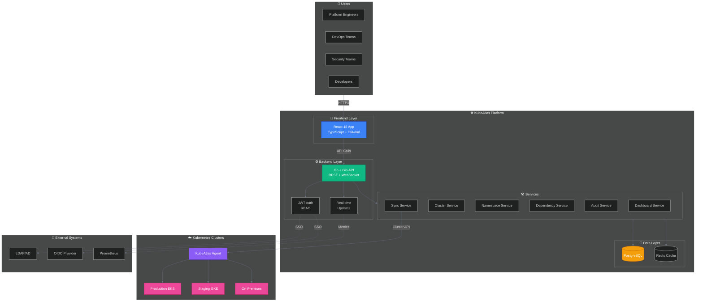
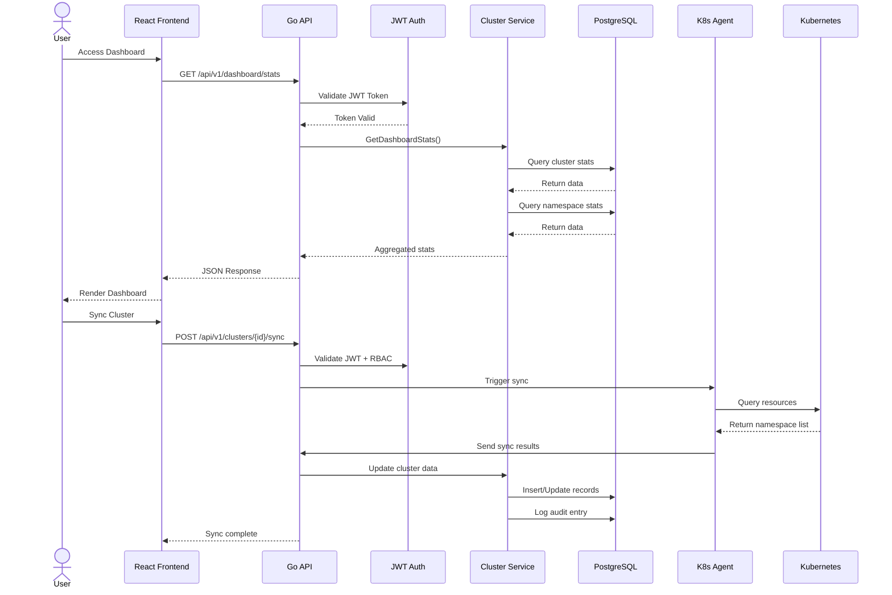

<div align="center">

<!-- Logo Placeholder - Replace with actual logo when available -->
<h1 align="center">☸️ KubeAtlas</h1>
<p align="center">
  <strong>Central Kubernetes Inventory & Ownership Platform</strong>
</p>

<p align="center">
  <a href="https://github.com/ozcanfpolat/kubeatlas/blob/main/LICENSE">
    
  </a>
  <a href="#quick-start">
    
  </a>
  <a href="#helm-installation">
    
  </a>
</p>

<p align="center">
  <a href="#features">Features</a> •
  <a href="#architecture">Architecture</a> •
  <a href="#screenshots">Screenshots</a> •
  <a href="#quick-start">Quick Start</a> •
  <a href="#documentation">Docs</a>
</p>

---

</div>

## 🎯 Overview

**KubeAtlas** is a comprehensive governance platform designed to bring clarity and ownership visibility to Kubernetes/OpenShift estates. Unlike observability tools that focus on metrics and logs, KubeAtlas centers on **operational ownership**, **accountability**, and **governance**.

### Why KubeAtlas?

Managing multiple Kubernetes clusters across different teams and environments often leads to:
- 🔍 **Unknown ownership** - Who owns this namespace?
- 📋 **Missing documentation** - Where are the runbooks?
- 🔗 **Hidden dependencies** - What breaks if this changes?
- 📊 **No governance visibility** - Are we compliant?

KubeAtlas solves these by providing a **central source of truth** for all your Kubernetes resources.

---

## ✨ Features

### 📊 Interactive Dashboard
Get real-time insights into your Kubernetes inventory:

| Metric | Description |
|--------|-------------|
| **Total Clusters** | Overview of all connected Kubernetes clusters |
| **Namespace Count** | Complete inventory of all namespaces |
| **Ownership Coverage** | Track which namespaces have assigned owners |
| **Orphaned Resources** | Identify namespaces without ownership |
| **Environment Distribution** | Visual breakdown by environment (Prod, Staging, Dev) |
| **Recent Activities** | Audit trail of all changes |

<!-- Dashboard Screenshot Placeholder -->
<!--  -->

### 🔐 Ownership Management
Define and track ownership at multiple levels:
- **Infrastructure Owner** - Technical team responsible
- **Business Unit** - Organizational department
- **Application Manager** - Primary contact
- **Technical Lead** - Engineering lead
- **Project Manager** - Project oversight

### 📦 Cluster & Namespace Inventory
- **Multi-cluster support** - Connect and manage multiple K8s clusters
- **Auto-discovery** - Automatically discover namespaces and resources
- **Metadata enrichment** - Add custom fields, tags, and labels
- **Environment classification** - Prod, Staging, Dev, Test segregation

### 🔗 Dependency Mapping
Visualize and manage dependencies:
- **Internal Dependencies** - Namespace-to-namespace dependencies
- **External Dependencies** - Third-party service dependencies
- **Dependency Graph** - Interactive visualization
- **Impact Analysis** - Understand change impact

<!-- Dependency Graph Screenshot Placeholder -->
<!--  -->

### 📄 Document Management
Centralize your documentation:
- **Architecture diagrams** - Link to architecture docs
- **Runbooks** - Operational procedures
- **SLA documents** - Service level agreements
- **Security policies** - Compliance documentation
- **Custom categories** - Define your own document types

### 📝 Audit Trail
Complete audit history:
- **Change tracking** - Who changed what and when
- **Activity logs** - All user actions
- **Resource history** - Per-resource audit trail
- **Compliance reporting** - Export for audits

---

## 🏗️ Architecture



### Component Flow



### Tech Stack

| Layer | Technology | Purpose |
|-------|------------|---------|
| **Frontend** | React 18, TypeScript, Tailwind CSS, shadcn/ui | Modern UI with type safety |
| **Backend** | Go 1.21, Gin framework, pgx | High-performance API |
| **Database** | PostgreSQL 14+, Redis | Persistent & cache storage |
| **Auth** | JWT + RBAC + LDAP/OIDC | Secure authentication |
| **Deployment** | Docker, Kubernetes, Helm | Container orchestration |
| **Monitoring** | Prometheus, Grafana | Observability |

---

## 📸 Screenshots & UI Preview

> **Note:** Screenshots below are placeholder descriptions. Replace with actual screenshots after deployment.

### 🎯 Dashboard Overview
The main dashboard provides a comprehensive overview of your Kubernetes inventory with statistics, charts, and recent activities.

<!--  -->

<details>
<summary>📊 Click to view Dashboard UI Structure</summary>

```
┌─────────────────────────────────────────────────────────────────────────────┐
│  ☸️ KubeAtlas                                                    👤 Admin  │
├─────────────────────────────────────────────────────────────────────────────┤
│  Dashboard  Clusters  Namespaces  Dependencies  Documents  Teams  Settings  │
├─────────────────────────────────────────────────────────────────────────────┤
│                                                                             │
│  Dashboard                                                                  │
│  Overview of your Kubernetes inventory                                      │
│                                                                             │
│  ┌──────────────┐ ┌──────────────┐ ┌──────────────┐ ┌──────────────┐       │
│  │ Total        │ │ Total        │ │ Active       │ │ Orphaned     │       │
│  │ Clusters     │ │ Namespaces   │ │ Teams        │ │ Namespaces   │       │
│  │              │ │              │ │              │ │              │       │
│  │     12       │ │    156       │ │     8        │ │     4        │       │
│  │ 10 active    │ │              │ │              │ │              │       │
│  └──────────────┘ └──────────────┘ └──────────────┘ └──────────────┘       │
│                                                                             │
│  ┌──────────────────────────────┐ ┌──────────────────────────────────────┐ │
│  │  Environment Distribution    │ │  Ownership Coverage                  │ │
│  │                              │ │                                      │ │
│  │  ████████████████████  45%   │ │  ████████████████████████  85%      │ │
│  │  ██████████████        28%   │ │  ██                       15%      │ │
│  │  ██████████████████    37%   │ │                                      │ │
│  │  ██████████            19%   │ │  With Owner: 132 namespaces         │ │
│  │                              │ │  Orphaned:    24 namespaces         │ │
│  │  Production Staging Dev Test │ │                                      │ │
│  └──────────────────────────────┘ └──────────────────────────────────────┘ │
│                                                                             │
│  ┌──────────────────────────────┐ ┌──────────────────────────────────────┐ │
│  │  Recent Activities           │ │  Missing Information                 │ │
│  │                              │ │                                      │ │
│  │  📝 Team updated...    2m    │ │  ⚠️  production-api                  │ │
│  │  🔄 Cluster synced...  15m   │ │      Missing: owner, cost center    │ │
│  │  ➕ Namespace added... 1h     │ │                                      │ │
│  │  📄 Document added...  2h    │ │  ⚠️  staging-database                │ │
│  │                              │ │      Missing: documentation         │ │
│  └──────────────────────────────┘ └──────────────────────────────────────┘ │
│                                                                             │
└─────────────────────────────────────────────────────────────────────────────┘
```

</details>

### 🔧 Cluster Management
View and manage all your Kubernetes clusters from a single interface with filtering and search capabilities.

<!--  -->

<details>
<summary>🖥️ Click to view Clusters UI Structure</summary>

```
┌─────────────────────────────────────────────────────────────────────────────┐
│  Clusters                                                                   │
│  Manage your Kubernetes clusters                                            │
│                                                          [➕ Add Cluster]   │
│                                                                             │
│  ┌──────────────────────────┐ ┌─────────────┐ ┌─────────────┐              │
│  │ 🔍 Search clusters...    │ │ Status ▼    │ │ Environment ▼│              │
│  └──────────────────────────┘ └─────────────┘ └─────────────┘              │
│                                                                             │
│  ┌────────────────────────────────────────────────────────────────────────┐ │
│  │ Name           │ Environment │ Status   │ Namespaces │ Last Sync      │ │
│  ├────────────────────────────────────────────────────────────────────────┤ │
│  │ production-eks │ Production  │ 🟢 Active│     45     │ 2 minutes ago  │ │
│  │ staging-gke    │ Staging     │ 🟢 Active│     28     │ 5 minutes ago  │ │
│  │ dev-aks        │ Development │ 🟢 Active│     67     │ 1 hour ago     │ │
│  │ test-openshift │ Test        │ 🟡 Syncing│    16     │ In progress    │ │
│  │ legacy-cluster │ Production  │ 🔴 Inactive│    0     │ 3 days ago     │ │
│  └────────────────────────────────────────────────────────────────────────┘ │
│                                                                             │
│  Showing 5 of 12 clusters                                      ← 1 2 3 →    │
└─────────────────────────────────────────────────────────────────────────────┘
```

</details>

### 📦 Namespace Management
Comprehensive namespace inventory with ownership tracking, cost allocation, and compliance status.

<!--  -->

<details>
<summary>📋 Click to view Namespaces UI Structure</summary>

```
┌─────────────────────────────────────────────────────────────────────────────┐
│  Namespaces                                                                 │
│  156 namespaces across all clusters                                         │
│                                                                   [Export]  │
│                                                                             │
│  🔍 Search    Cluster ▼    Environment ▼    Criticality ▼    ☑ Orphaned   │
│                                                                             │
│  ┌────────────────────────────────────────────────────────────────────────┐ │
│  │ Namespace       │ Cluster        │ Env        │ Owner      │ Critical │ │
│  ├────────────────────────────────────────────────────────────────────────┤ │
│  │ payment-service │ production-eks │ Production │ Platform   │ Critical │ │
│  │ user-auth       │ production-eks │ Production │ Security   │ Critical │ │
│  │ frontend-app    │ staging-gke    │ Staging    │ Frontend   │ High     │ │
│  │ data-pipeline   │ staging-gke    │ Staging    │ Data Team  │ Medium   │ │
│  │ test-runner     │ dev-aks        │ Development│ QA Team    │ Low      │ │
│  │ ⚠️ untracked-ns │ production-eks │ Production │ —          │ Unknown  │ │
│  └────────────────────────────────────────────────────────────────────────┘ │
│                                                                             │
│  ← 1 2 3 4 5 ... 16 →                                          Page 1 of 16 │
└─────────────────────────────────────────────────────────────────────────────┘
```

</details>

### 🔗 Dependency Visualization
Interactive graph showing dependencies between namespaces with drill-down capabilities.

<!--  -->

<details>
<summary>🕸️ Click to view Dependencies UI Structure</summary>

```
┌─────────────────────────────────────────────────────────────────────────────┐
│  Dependencies                                                               │
│  Visualize relationships between namespaces                                 │
│                                                                             │
│  ┌────────────────────────────────────────────────────────────────────────┐ │
│  │                                                                        │ │
│  │                       ┌─────────────────┐                              │ │
│  │                       │  API Gateway    │                              │ │
│  │                       │   (nginx-ingress)│                             │ │
│  │                       └────────┬────────┘                              │ │
│  │                                │                                       │ │
│  │              ┌─────────────────┼─────────────────┐                     │ │
│  │              │                 │                 │                     │ │
│  │              ▼                 ▼                 ▼                     │ │
│  │     ┌─────────────┐   ┌─────────────┐   ┌─────────────┐               │ │
│  │     │ Auth Service│   │User Service │   │Order Service│               │ │
│  │     │  (Keycloak) │   │   (Node.js) │   │   (Java)    │               │ │
│  │     └──────┬──────┘   └──────┬──────┘   └──────┬──────┘               │ │
│  │            │                 │                 │                       │ │
│  │            │                 │                 │                       │ │
│  │            ▼                 ▼                 ▼                       │ │
│  │     ┌─────────────┐   ┌─────────────┐   ┌─────────────┐               │ │
│  │     │   Redis     │   │ PostgreSQL  │   │  RabbitMQ   │               │ │
│  │     │   Cache     │   │   Primary   │   │   Queue     │               │ │
│  │     └─────────────┘   └─────────────┘   └─────────────┘               │ │
│  │                                                                        │ │
│  │  Legend: ─── HTTP/API  ─ ─ Message Queue  ··· Database               │ │
│  │                                                                        │ │
│  └────────────────────────────────────────────────────────────────────────┘ │
│                                                                             │
│  Selected: payment-service     [View Details]  [Edit Dependencies]          │
└─────────────────────────────────────────────────────────────────────────────┘
```

</details>

### 📄 Document Repository
Centralized documentation management with version control and access permissions.

<!--  -->

<details>
<summary>📚 Click to view Documents UI Structure</summary>

```
┌─────────────────────────────────────────────────────────────────────────────┐
│  Documents                                                                  │
│  Centralized documentation repository                                       │
│                                                                    [➕ New] │
│                                                                             │
│  🔍 Search documents...    Category ▼    Type ▼    Sort by: Updated ▼       │
│                                                                             │
│  ┌────────────────────────────────────────────────────────────────────────┐ │
│  │ 📄 Payment Service Runbook                                             │ │
│  │    Category: Runbooks        Type: Markdown      Updated: 2 hours ago  │ │
│  │    Owner: Platform Team      Size: 24 KB                             │ │
│  │                                                                        │ │
│  │ 📊 Architecture Diagram - Auth Flow                                    │ │
│  │    Category: Architecture    Type: Draw.io       Updated: 1 day ago    │ │
│  │    Owner: Security Team      Size: 156 KB                            │ │
│  │                                                                        │ │
│  │ 📋 SLA Document - Payment APIs                                         │ │
│  │    Category: SLA             Type: PDF           Updated: 1 week ago   │ │
│  │    Owner: Product Team       Size: 1.2 MB                            │ │
│  │                                                                        │ │
│  │ 🔐 Security Policy - Data Classification                               │ │
│  │    Category: Security        Type: Confluence    Updated: 2 weeks ago  │ │
│  │    Owner: Security Team      Size: Link                              │ │
│  └────────────────────────────────────────────────────────────────────────┘ │
└─────────────────────────────────────────────────────────────────────────────┘
```

</details>

### 👥 Team Management
Organize teams, assign ownership, and manage access control.

<!--  -->

<details>
<summary>👤 Click to view Teams UI Structure</summary>

```
┌─────────────────────────────────────────────────────────────────────────────┐
│  Teams                                                                      │
│  Manage teams and ownership assignments                                     │
│                                                                  [➕ Team]  │
│                                                                             │
│  ┌────────────────────────────────────────────────────────────────────────┐ │
│  │ Team Name       │ Members │ Namespaces │ Business Unit    │ Cost Center│ │
│  ├────────────────────────────────────────────────────────────────────────┤ │
│  │ 🚀 Platform     │   12    │     24     │ Engineering      │ ENG-001    │ │
│  │ 🔐 Security     │    5    │      8     │ Engineering      │ ENG-002    │ │
│  │ 💳 Payments     │    8    │     12     │ Product          │ PROD-001   │ │
│  │ 📊 Data Team    │    6    │     15     │ Engineering      │ ENG-003    │ │
│  │ 🎨 Frontend     │    9    │     18     │ Product          │ PROD-002   │ │
│  └────────────────────────────────────────────────────────────────────────┘ │
│                                                                             │
│  Selected: Platform Team                                                    │
│  ┌────────────────────────────────────────────────────────────────────────┐ │
│  │ 👤 John Doe (Lead)  👤 Jane Smith  👤 Bob Johnson  👤 Alice Wang      │ │
│  └────────────────────────────────────────────────────────────────────────┘ │
└─────────────────────────────────────────────────────────────────────────────┘
```

</details>

### 📝 Audit Logs
Complete audit trail for compliance and troubleshooting.

<!--  -->

<details>
<summary>📋 Click to view Audit Logs UI Structure</summary>

```
┌─────────────────────────────────────────────────────────────────────────────┐
│  Audit Logs                                                                 │
│  Complete activity history                                                  │
│                                                                [📥 Export]  │
│                                                                             │
│  Date range: [2024-01-01] to [2024-12-31]    User ▼    Action ▼    Resource│ │
│                                                                             │
│  ┌────────────────────────────────────────────────────────────────────────┐ │
│  │ Timestamp        │ User        │ Action      │ Resource    │ Status   │ │
│  ├────────────────────────────────────────────────────────────────────────┤ │
│  │ 2024-12-15 14:32 │ john.doe    │ UPDATE      │ Team        │ ✅ Success│ │
│  │ 2024-12-15 14:30 │ jane.smith  │ CREATE      │ Document    │ ✅ Success│ │
│  │ 2024-12-15 14:15 │ bob.admin   │ DELETE      │ Cluster     │ ✅ Success│ │
│  │ 2024-12-15 13:45 │ alice.dev   │ SYNC        │ Cluster     │ ⚠️ Warning│ │
│  │ 2024-12-15 13:30 │ john.doe    │ UPDATE      │ Namespace   │ ✅ Success│ │
│  │ 2024-12-15 12:00 │ system      │ AUTO_SYNC   │ Cluster     │ ✅ Success│ │
│  └────────────────────────────────────────────────────────────────────────┘ │
└─────────────────────────────────────────────────────────────────────────────┘
```

</details>

---

## 🚀 Quick Start

### Prerequisites

- Docker 20.10+ and Docker Compose
- (Optional) Go 1.21+ for local development
- (Optional) Node.js 18+ for local frontend development

### Option 1: Docker Compose (Recommended)

```bash
# Clone the repository
git clone https://github.com/ozcanfpolat/kubeatlas.git
cd kubeatlas

# Start all services
make dev

# Or manually:
# docker compose -f docker-compose.dev.yml up -d
```

### Option 2: Local Development

```bash
# Start infrastructure services
docker compose -f docker-compose.dev.yml up postgres adminer -d

# Backend
cd backend
go mod download
go run cmd/api/main.go

# Frontend (in a new terminal)
cd frontend
npm install
npm run dev
```

### Access the Application

| Service | URL | Credentials |
|---------|-----|-------------|
| Web UI | http://localhost:3000 | admin@kubeatlas.local / admin123 |
| API | http://localhost:8080 | JWT Token required |
| Database Admin | http://localhost:8081 | See docker-compose.yml |

### Initialize Database

```bash
# Run migrations
make db-migrate

# Seed sample data
make db-seed
```

---

## ☸️ Helm Installation

Deploy KubeAtlas to your Kubernetes cluster:

```bash
# Add namespace
kubectl create namespace kubeatlas

# Install with Helm
helm upgrade --install kubeatlas ./helm/kubeatlas \
  --namespace kubeatlas \
  --set ingress.enabled=true \
  --set ingress.host=kubeatlas.yourdomain.com

# For OpenShift
helm upgrade --install kubeatlas ./helm/kubeatlas \
  --namespace kubeatlas \
  -f deploy/values-openshift.yaml
```

---

## 📁 Repository Structure

```
kubeatlas/
├── backend/                 # Go backend API
│   ├── cmd/                # Application entrypoints
│   ├── internal/           # Internal packages
│   │   ├── api/           # HTTP handlers & middleware
│   │   ├── config/        # Configuration
│   │   ├── database/      # Database connection & migrations
│   │   ├── models/        # Data models
│   │   ├── services/      # Business logic
│   │   └── k8s/          # Kubernetes client
│   └── go.mod
├── frontend/               # React TypeScript frontend
│   ├── src/
│   │   ├── api/          # API client
│   │   ├── components/   # React components
│   │   ├── pages/        # Page components
│   │   └── store/        # State management
│   └── package.json
├── database/              # SQL schemas and migrations
├── helm/                  # Helm charts
├── docker/                # Dockerfiles
└── docs/                  # Documentation
```

---

## 📚 Documentation

- [Installation Guide](docs/INSTALLATION.md)
- [Adding Clusters](docs/ADDING_CLUSTERS.md)
- [API Documentation](docs/api/openapi.yaml)
- [Project Structure](docs/PROJECT_STRUCTURE.md)

---

## 🤝 Contributing

We welcome contributions! Please see [CONTRIBUTING.md](CONTRIBUTING.md) for guidelines.

### Development Workflow

1. Fork the repository
2. Create your feature branch (`git checkout -b feature/amazing-feature`)
3. Commit your changes (`git commit -m 'Add amazing feature'`)
4. Push to the branch (`git push origin feature/amazing-feature`)
5. Open a Pull Request

---

## 📄 License

This project is licensed under the Apache License 2.0 - see the [LICENSE](LICENSE) file for details.

---

## 💬 Support

- 📧 Email: support@kubeatlas.local
- 🐛 Issues: [GitHub Issues](https://github.com/ozcanfpolat/kubeatlas/issues)
- 💬 Discussions: [GitHub Discussions](https://github.com/ozcanfpolat/kubeatlas/discussions)

---

<p align="center">
  Built with ❤️ for the Kubernetes community
</p>
